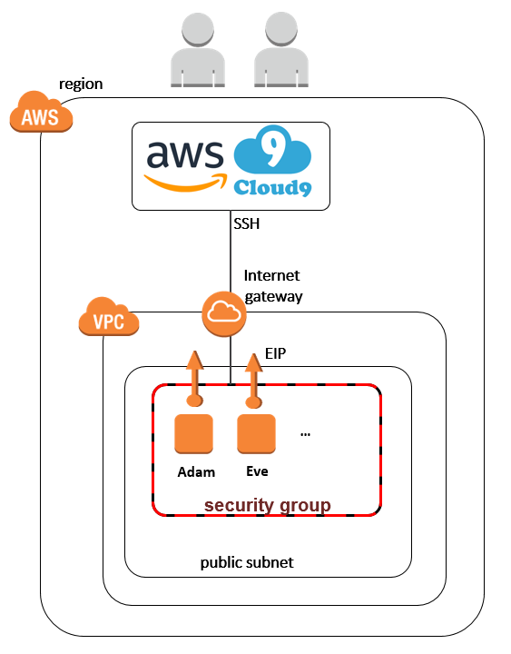

## Module to launch cloud9 ec2s of ssh-type (including VPC, Subnet,..)

Usage: see example folder

Readme.md is generated with `terraform-docs md . > Readme.md`

## Inputs

| Name | Description | Type | Default | Required |
|------|-------------|:----:|:-----:|:-----:|
| env_names | List of names for the cloud9 environments | list | - | yes |
| env_pubkeys | List of public keys for the cloud9 environments (retrieved from AWS cloud9 set-up) | list | - | yes |
| instance_type | Instance type of the EC2s | string | `t2.micro` | no |
| name | Used for prefixing / tagging the ec2s and related resources | string | `cloud9` | no |
| region | region where the resources shall be launched | string | `eu-west-1` | no |
| user_data_file | Can be used to use a different user data file than the default userdata.sh | string | `` | no |
| vpc_cidr_block | CIDR block for the VPC and subnet | string | `172.101.0.0/16` | no |

## Outputs

| Name | Description |
|------|-------------|
| ip_addresses | The IP addesses of the launched ec2 (to be used in the cloud9 environment config |

